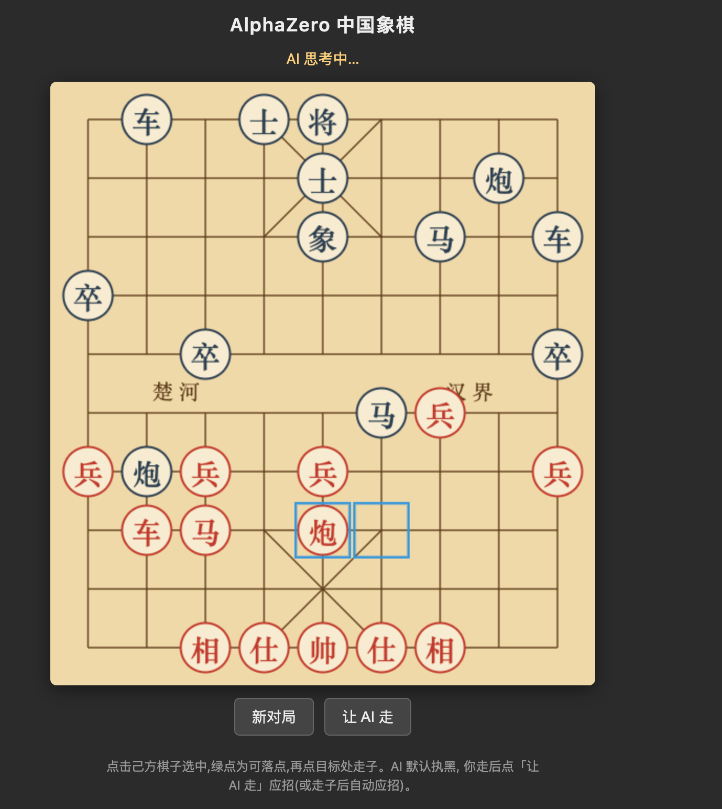

# chinese-chess-alpha-zero

> AlphaZero 中国象棋

用 AlphaZero 算法从零训练的中国象棋 AI:**自我对弈 + 蒙特卡洛树搜索(MCTS)+ 策略-价值网络**,无需人类棋谱即可习得棋力。提供命令行与网页两种对弈方式,支持单机多卡(DDP)与多进程并行训练。


<p align="center">
  
  <br>
  <em>网页对弈界面:点击选子,绿点提示合法落点,AI 自动应招</em>
</p>

## 特性

- **纯 AlphaZero 自我对弈**:从随机权重开始,靠自我博弈 + MCTS 迭代提升,无需人类数据。
- **完整中国象棋规则引擎**:走法生成、将军/白脸将检测、长将判负、重复局面裁决。
- **策略-价值 ResNet**:2550 维固定动作空间,15×10×9 状态编码(当前走方视角)。
- **多种训练规模**:串行(调试)、多进程并行(单机正式)、多卡 DDP(`torchrun`)。
- **多 GPU 推理服务**:中央服务攒批前向,CPU worker 只跑搜索,吃满多卡 + 多核。
- **工程化完备**:评估门控、断点续训(含 replay buffer)、指标落盘、checkpoint 清理。
- **可选监督预训练**:用人类棋谱做冷启动,加速早期收敛。
- **网页对弈界面**:纯标准库 `http.server`,无额外 web 框架依赖。

## 快速开始

### 安装

```bash
git clone <your-repo-url>
cd chinese-chess-alpha-zero
python3 -m venv .venv
.venv/bin/pip install -r requirements.txt
```

### 快速体验(用预训练模型直接对弈)

仓库自带两个预训练模型,clone 后无需训练即可对弈:

- `checkpoints/pretrained_128x10.pt` —— 128×10 网络(推荐)
- `checkpoints/pretrained.pt` —— 64×6 较小网络

> ⚠️ **关于这两个模型**:它们**仅基于已有人类棋谱做监督预训练**(学习人类走法),
> **尚未经过 AlphaZero 自我对弈强化**。因此只具备**基础下棋能力**——开局较像样,
> 但中后盘计算偏弱,远未达到完整训练后的棋力。它们用于快速体验流程;要获得真正
> 的棋力,需在此基础上 `--resume` 进行自我对弈训练(见下方「训练」)。

**网页对弈**(浏览器棋盘):

```bash
.venv/bin/python -m xiangqi.webui \
    --checkpoint checkpoints/pretrained_128x10.pt \
    --simulations 800 --port 8000
```

打开 <http://127.0.0.1:8000>,点棋子 → 绿点是合法落点 → 点目标走子,AI 自动应招。

**命令行对弈**:

```bash
.venv/bin/python -m xiangqi.play \
    --checkpoint checkpoints/pretrained_128x10.pt --simulations 800
```

> **关于 `--simulations`**:它是每走一步时 MCTS(蒙特卡洛树搜索)做多少次模拟推演。
> 数值越大,搜索越深、AI 越强,但每步耗时也越长(大致成正比)。它**只影响对弈时的
> 思考强度,不改变模型权重**——同一个模型,simulations 越高棋力越强。对弈推荐
> 400~800;想更强可上 1200+,但每步会明显变慢。降到 100~200 则响应快、棋力弱。

### 运行测试

```bash
.venv/bin/python -m pytest tests/ -v   # 应显示 80 passed
```

### 本地跑通流程(几分钟,验证用)

在 CPU 或 Apple Silicon(MPS)上跑一个迷你训练,把"训练 → 出模型 → 对弈"整条路走通:

```bash
.venv/bin/python -m xiangqi.pipeline \
    --iterations 5 --games-per-iter 4 --simulations 50 \
    --channels 32 --blocks 4 --device cpu
```

> ⚠️ 这个迷你模型几乎不会下棋,只用来熟悉流程。有棋力的模型需大参数 + 长训练(见下)。

### 网页对弈

```bash
.venv/bin/python -m xiangqi.webui \
    --checkpoint checkpoints/latest.pt --simulations 400 --port 8000
```

打开 <http://127.0.0.1:8000>:点棋子 → 绿点是合法落点 → 点目标走子,AI 自动应招。

- `--ai-side red|black`:AI 执哪方(默认黑)。
- 不提供 `--checkpoint` 时 AI 走随机合法着法,可先体验界面。
- `--simulations` 越大 AI 越强但越慢,对弈推荐 400~800。

### 命令行对弈

```bash
.venv/bin/python -m xiangqi.play \
    --checkpoint checkpoints/latest.pt --simulations 400
```

走法输入格式 `r1 c1 r2 c2`(起点行列、终点行列),如 `0 1 2 2`。

## 训练

### 并行训练(推荐,单机正式训练)

多 worker 进程持续自我对弈,主进程消费样本并训练,吞吐随 worker 数近线性提升:

```bash
.venv/bin/python -m xiangqi.pipeline_parallel \
    --iterations 200 --games-per-iter 100 --workers 8 \
    --simulations 400 --channels 128 --blocks 10 --batch-size 512 \
    --train-device cuda --worker-device cpu
```

- `--workers`:自我对弈进程数,默认取 CPU 核数。
- `--train-device cuda --worker-device cpu`:训练用 GPU,worker 推理用 CPU,避免争显存。
- `--min-buffer`:buffer 暖机阈值,达到后才开始训练。
- worker 通过共享版本号感知权重更新,每轮训练后主进程原子发布新权重并热重载。

#### 多 GPU 推理服务(多卡 + 多核机器)

中央推理服务独占多张 GPU 攒批前向,大量 CPU worker 只跑 MCTS 搜索,适合"多卡 + 多核"机型吃满算力:

```bash
.venv/bin/python -m xiangqi.pipeline_parallel \
    --iterations 1000 --games-per-iter 96 --workers 120 \
    --simulations 400 --channels 128 --blocks 10 --batch-size 512 \
    --inference-server --num-gpus 4 --server-device cuda \
    --max-infer-batch 512 --train-device cuda:0
```

### 多卡数据并行(DDP)

用 `torchrun` 拉起,每个 rank 占一块卡,各自自我对弈 + 训练,反向传播时 DDP 自动 all-reduce 梯度(等价于把有效 batch 放大 world_size 倍):

```bash
torchrun --nproc_per_node=4 -m xiangqi.pipeline_ddp \
    --iterations 200 --games-per-iter 25 --simulations 400 \
    --channels 128 --blocks 10 --batch-size 512
```

- `--games-per-iter` 是**每个 rank** 的局数,总吞吐 = world_size × 该值。
- 仅 rank 0 落盘 checkpoint 与打印日志;各 rank 各存 `buffer_rank{N}.npz`。
- 不经 `torchrun` 直接运行时退化为单卡训练,便于本地调试。

### 评估门控(arena gating)

可选的稳健化措施(AlphaGo Zero 做法):每轮训练后让新网络(challenger)与上一代(champion)对弈若干局,得分率达标才晋级,否则回退本轮训练,避免一次坏训练污染数据分布。

```bash
.venv/bin/python -m xiangqi.pipeline \
    --iterations 200 --games-per-iter 100 --simulations 400 \
    --channels 128 --blocks 10 --batch-size 512 \
    --gating --eval-interval 5 --eval-games 40 --eval-threshold 0.55
```

- `--gating`:启用门控。`--eval-interval`:每隔多少轮评估。
- `--eval-games`:门控对弈局数,两网络轮流执红消除先手优势。
- `--eval-threshold`:晋级所需得分率(胜 1、和 0.5),默认 0.55。

### 断点续训

```bash
--resume checkpoints/latest.pt
```

每轮把 replay buffer 存为 `checkpoints/buffer.npz`,`--resume` 时连同 buffer 一起恢复,避免重启后重新暖机。

### 监督预训练(可选冷启动)

用人类棋谱让网络先学到基本棋感,再转入自我对弈。棋谱为 JSON:

```json
[{"moves": ["炮二平五", "马8进7", "..."], "result": "red_win"}, ...]
```

```bash
.venv/bin/python -m xiangqi.pretrain \
    --games records.json --out checkpoints/pretrained.pt \
    --channels 128 --blocks 10 --epochs 10
```

然后正式训练用 `--resume checkpoints/pretrained.pt` 接续(优化器从头初始化:预训练用 Adam、正式训练用 SGD)。遇到无法解析或非法的着法会跳过该局剩余部分,避免脏数据。

> 棋谱数据未包含在仓库中。可从 [CGLemon/chinese-chess-PGN](https://github.com/CGLemon/chinese-chess-PGN) 获取中文记谱 PGN,再用内置脚本转换成预训练所需的 JSON:
>
> ```bash
> .venv/bin/python -m xiangqi.pgn_to_json path/to/games.pgn -o data/all_games.json
> ```

## 项目结构

```
xiangqi/
  constants.py          坐标系、棋子编码、九宫/半场判定
  board.py              棋盘状态、初始布局、显示
  movegen.py            走法生成、将军检测、白脸将、合法走法过滤
  game.py               对局状态(push/pop、终局判定、重复检测)
  encoding.py           动作空间编码(2550 维固定动作表)
  state_encoder.py      状态张量编码(15×10×9,当前走方视角)
  network.py            策略-价值 ResNet
  evaluator.py          网络推理封装(供 MCTS 调用)
  mcts.py               蒙特卡洛树搜索(PUCT)
  selfplay.py           自我对弈,生成训练样本
  parallel_selfplay.py  多进程并行自我对弈(生产者-消费者)
  inference_server.py   多 GPU 推理服务(攒批前向)
  train.py              replay buffer + 损失 + 训练步
  arena.py              评估门控:新旧网络对弈,按得分率决定晋级
  pipeline.py           串行训练循环(调试/小规模验证)
  pipeline_parallel.py  并行训练循环(多 worker,正式训练)
  pipeline_ddp.py       多卡数据并行训练(torchrun + DDP)
  distributed.py        DDP 进程组初始化/rank 探测辅助
  metrics.py            训练指标记录(CSV,可选 TensorBoard)
  move_notation.py      中文记谱解析(炮二平五 → 坐标走法)
  pretrain.py           人类棋谱监督预训练(冷启动加速)
  play.py               对弈接口(命令行人机/机机)
  webui.py              Web 对弈服务(标准库 http.server,JSON API)
  webui_page.py         Web 前端页面(canvas 棋盘 + 交互 JS)
tests/                  规则引擎、编码、网络、MCTS、并行、门控等单元测试(80 项)
scripts/                云端部署/训练/拉取脚本(需自配 SSH 别名,见下)
docs/                   架构、部署、训练、踩坑等细分文档
```

## 设计要点

- **坐标**:10 行 × 9 列,`(row, col)`,row 0 为红方底线。棋子用正负整数编码(正红负黑)。
- **动作空间**:2550 维固定表,覆盖任意局面下所有合法走法,经随机对弈验证完整性。
- **状态编码**:当前走方视角(轮走方棋子始终在前 7 平面),利用阵营对称性。
- **价值约定**:网络与 MCTS 节点价值均为"该节点轮走方"视角,回传时逐层取反。
- **温度数值稳定**:`π ∝ N^(1/τ)` 先按最大访问数归一化再做幂,避免大指数溢出。
- **MCTS 批量推理(virtual loss)+ 树复用**:减少网络调用、复用子树统计。

## 云端训练

`scripts/` 下提供了一键部署/训练/拉取脚本,配合云端 GPU 服务器使用。脚本通过环境变量 `REMOTE` 指定 SSH 主机别名(默认 `myserver`),需先在本地 `~/.ssh/config` 配好对应主机:

```bash
bash scripts/deploy.sh        # 打包上传 + 建环境 + 装依赖 + 自检
ssh <your-host> "cd ~/board && screen -dmS train bash scripts/train.sh"
bash scripts/fetch.sh         # 训练成果拉回本地(释放实例前必做)
```

详细步骤见 [`docs/`](docs/) 与云端使用指南。脚本中的服务器地址、端口等均以占位符 `<SERVER_IP>` 表示,使用前请替换为自己的环境。

## 算力预期

AlphaZero 原版用上千 TPU。单卡/中等规模下达到像样棋力需数天到数周。瓶颈通常在 CPU 自我对弈(产生对局样本),而非 GPU 训练步——加速主要靠增加并行 worker 数与 CPU 核数。可选用人类棋谱做监督预训练加速冷启动。

## 已知限制

- **竞技级规则**:长将已判负;长捉(连续捉子)等更复杂裁决仍按重复和棋处理。
- **记谱覆盖**:支持单子与同纵线两子(前/后);同线三子及以上(多兵 前中后)暂未实现。

## 致谢

- 人类棋谱数据来自 [CGLemon/chinese-chess-PGN](https://github.com/CGLemon/chinese-chess-PGN),用于监督预训练的冷启动。
- 算法参考 DeepMind 的 AlphaZero / AlphaGo Zero 论文。

## 许可

本项目采用 [MIT License](LICENSE)。数据集版权归原作者所有,请遵循其原始许可。

